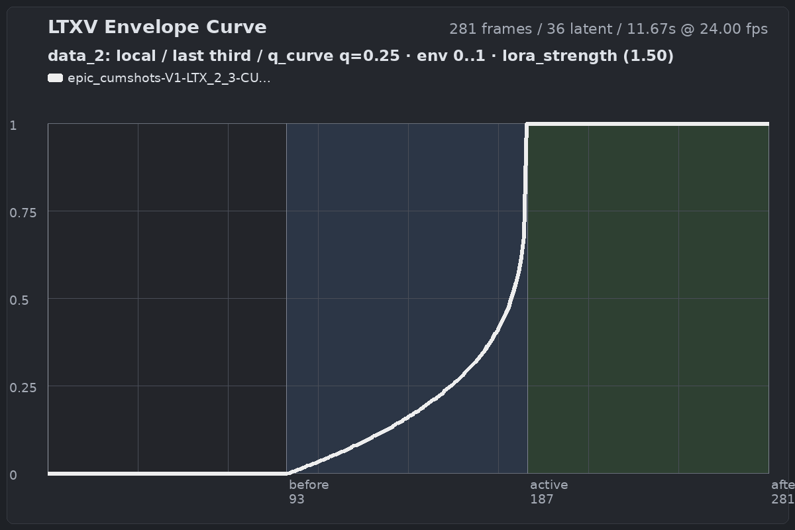
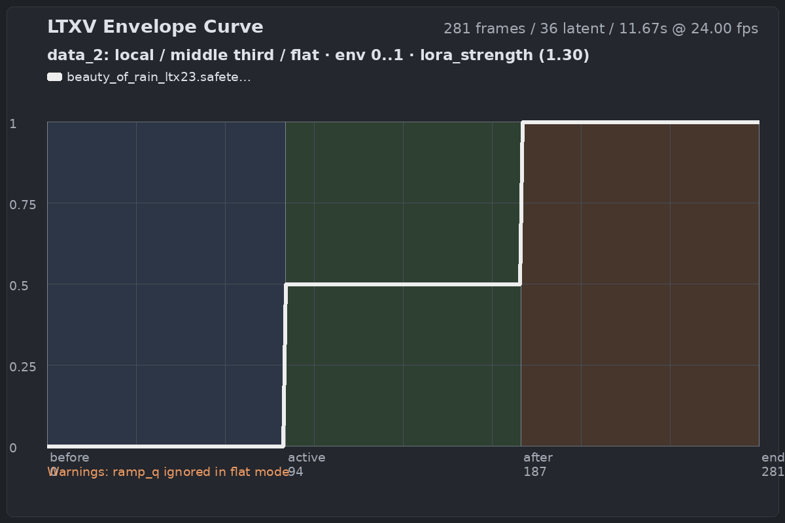
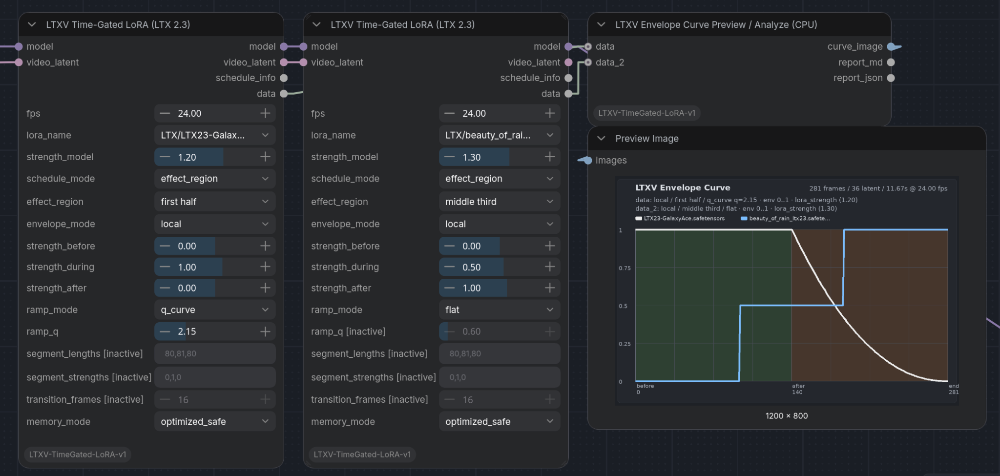

# ComfyUI-LTXV-TimeGated-LoRA v1.1

Temporal LoRA envelopes for **LTX 2.3** in ComfyUI.

**LTXV Time-Gated LoRA (LTX 2.3)** lets you apply visual LTX 2.3 LoRAs only during selected parts of a single continuous video sampling run. Use it for style reveals, transformation beats, age/slider changes, mood shifts, character/style intensity curves, or stacked LoRA events in one clip.

v1.1 is the **Curve Preview Release**. It adds local envelope modes, q-shaped ramps, a reusable `data` output on the productive node, and a CPU-rendered curve preview/analyzer with optional `data_2` overlay.

---

## Scope

- Visual LTX 2.3 LoRA layers only.
- Temporal audio LoRA gating is intentionally not currently supported.
- `effect_region` mode for fast placement by halves, thirds, and quarters.
- `manual_frames` mode for exact signed multi-segment schedules.
- Timing is derived from the required final **video-only** `video_latent`.
- Multiple instances can be chained additively.
- Low-rank temporal gating includes a safe mode and an experimental lower-VRAM in-place mode.

---

## Nodes

### LTXV Time-Gated LoRA (LTX 2.3)

The productive model-patching node.

Outputs:

- `model` — patched MODEL path.
- `video_latent` — unchanged timing latent passthrough for stacking.
- `schedule_info` — compact resolved-schedule and compatibility report.
- `data` — combined envelope/timeline payload for the preview/analyze node.

### LTXV Envelope Curve Preview / Analyze (CPU)

Renders a CPU-side preview image from `data` and optional `data_2`.

Use it to check the actual envelope before sampling:

- selected region
- flat vs q-curve behavior
- local envelope min/max
- `lora_strength` context
- stacked node overlays
- `data_2`-only fallback when the first node is bypassed

The preview renders as a normal ComfyUI `IMAGE`, so it can be connected to Preview Image or Save Image.

### LTXV Temporal Envelope Inspector (v1.1)

A non-patching standalone diagnostic node. It resolves the same type of envelope/timeline payload without applying a LoRA. This is useful for testing curve behavior independently from a specific LoRA file.

---

## Placement

Place **LTXV Time-Gated LoRA (LTX 2.3)**, or a chain of these nodes, **last in the MODEL chain directly before the sampler or guider**.

For a PromptRelay workflow:

```text
... -> PromptRelayEncode -> LTX2SamplingPreviewOverride
    -> LTXV Time-Gated LoRA
    -> optional additional LTXV Time-Gated LoRA
    -> SamplerCustom
```

Do not put this runtime-gated node in the normal static LoRA group near the model loader. Static LoRAs and distilled LoRAs may remain in their original upstream locations.

---

## `video_latent` timing and stacking

Connect the final **video-only** latent after image/FLF conditioning and before any audio/video concat node.

The node passes this latent through unchanged, so stacked nodes can be wired cleanly:

```text
Timing path:
LTXVImgToVideoInplaceKJ video_latent
  -> LTXV Time-Gated LoRA A video_latent
  -> LTXV Time-Gated LoRA B video_latent

MODEL path:
LTX2SamplingPreviewOverride MODEL
  -> LTXV Time-Gated LoRA A MODEL
  -> LTXV Time-Gated LoRA B MODEL
  -> SamplerCustom MODEL

Preview path:
LTXV Time-Gated LoRA A data -> Curve Preview data
LTXV Time-Gated LoRA B data -> Curve Preview data_2
```

Do **not** connect an audio+video combined latent to `video_latent`.

The node derives the real LTX timeline from the video temporal dimension and reports the resolved timeline in `schedule_info`. LTX 2.3 temporal compression is fixed internally to `8`.

---

## Inputs and outputs

### Main inputs

- `model`: completed LTX 2.3 MODEL path to patch.
- `video_latent`: required final video-only timing reference.
- `fps`: frame rate used for preview/report timing.
- `lora_name`: compatible visual LTX 2.3 LoRA.
- `strength_model`: global LoRA multiplier. Effective strength is `strength_model × local envelope value`.
- `schedule_mode`: `effect_region` or `manual_frames`.
- `effect_region`: selected active interval in `effect_region` mode.
- `envelope_mode`: `local`, `hold_strength`, or `transition_frames`.
- `strength_before`, `strength_during`, `strength_after`: local envelope levels for region-based scheduling.
- `ramp_mode`: `flat` or `q_curve`.
- `ramp_q`: q value for `q_curve`.
- `segment_lengths`, `segment_strengths`: used in `manual_frames` mode.
- `transition_frames`: used by `manual_frames` and `transition_frames` envelope mode.
- `memory_mode`: `optimized_safe` by default; `optimized_low_vram_inplace` is experimental.

The numeric strength widgets use practical `0.05` steps for mouse adjustment. `segment_strengths` remains a freely editable string for advanced schedules.

### Outputs

- `model`: patched MODEL path.
- `video_latent`: unchanged timing latent passthrough for stacking.
- `schedule_info`: compact resolved-schedule and compatibility report.
- `data`: combined `LTXV_ENVELOPE_DATA` payload for preview/analyze nodes.

---

## Envelope modes

### `local`

The main v1.1 envelope mode.

With `flat`, this creates clean before/during/after levels:

```text
strength_before -> strength_during -> strength_after
```

Example: one-node 3-step envelope:

```text
schedule_mode: effect_region
effect_region: middle third
envelope_mode: local
ramp_mode: flat
strength_before: 0.0
strength_during: 0.5
strength_after: 1.0
```

Result:

```text
first third  = 0.0
middle third = 0.5
last third   = 1.0
```

With `q_curve`, only the immediate neighboring segments become ramps:

```text
earlier timeline   : strength_before
preceding neighbor : strength_before -> strength_during
active region      : strength_during
following neighbor : strength_during -> strength_after
later timeline     : strength_after
```

### `hold_strength`

An explicit hold-style mode kept for compatibility and clarity. Use it when you want before/after strengths held as stable levels around the active region.

### `transition_frames`

Preserves the v1.0-style transition behavior. Before/during/after zones are blended at the selected effect boundaries using `transition_frames`.

Use this when you want the older boundary-crossfade logic rather than v1.1 local segment ramps.

---

## Ramp modes

### `flat`

No curve shaping. The envelope uses direct segment levels.

This is best for:

- step gates
- diagnostic tests
- hard or semi-hard reveals
- stochastic/detail LoRAs where gradual ramps may flicker

### `q_curve`

A front-loaded/delayed power curve for smooth ramps.

Formula:

```text
mix = 1 - (1 - t) ** q
```

Semantics:

- `q = 1.0`: linear
- `q > 1.0`: stronger/faster change at the beginning of the ramp segment, then a smoother finish
- `q < 1.0`: slower start, stronger/later change toward the end of the ramp segment

`ramp_q` changes the timing/shape of the ramp, not the strength endpoints. Strength values remain controlled by `strength_before`, `strength_during`, and `strength_after`.

---

## Visual envelope preview

v1.1 adds a CPU-rendered curve preview that shows the actual local LoRA envelope over the full video timeline.

The preview is useful for:

- checking whether the selected region is correct
- comparing stacked Time-Gated LoRA nodes
- debugging `flat` vs `q_curve`
- verifying `data` / `data_2` overlays before sampling
- inspecting a later `data_2` gate by itself when the first node is bypassed

### Example: late q-curve gate



A delayed q-curve where the LoRA stays inactive for most of the clip and ramps strongly into the last third.

### Example: three-step flat envelope



A flat local envelope using one node as a `0 → 0.5 → 1` step controller.

### Example: stacked Time-Gated LoRA nodes



Two Time-Gated LoRA nodes can be stacked in the MODEL path. Their `data` outputs can be connected to the Curve Preview / Analyze node as `data` and `data_2` to compare both envelopes in one plot.

---

## `manual_frames` mode

Use exact rendered-frame segment lengths and multipliers. Signed and decimal values are valid.

```text
schedule_mode: manual_frames
segment_lengths: 120,193,192
segment_strengths: 0,-1,1.5
```

The segment lengths must sum to the rendered frame length resolved from `video_latent`.

`transition_frames` applies boundary crossfades in `manual_frames` mode.

---

## PromptRelay compatibility

For simple synchronization, leave PromptRelay `segment_lengths` empty.

PromptRelay will evenly distribute its `|`-separated local prompts, which matches the region philosophy of this node when the prompt segmentation matches the selected granularity:

- halves: use **2** local prompt segments
- thirds: use **3** local prompt segments
- quarters: use **4** local prompt segments

Examples:

```text
middle third  -> prompt A | prompt B | prompt C
second quarter -> prompt A | prompt B | prompt C | prompt D
last half     -> prompt A | prompt B
```

For stacked nodes using mixed region types, exact PromptRelay synchronization may require manual segment planning.

### Trigger-dependent LoRAs

When a style LoRA requires a trigger word or activation phrase, include it inside every **active PromptRelay local segment** in which that Time-Gated LoRA is enabled.

Do not rely only on the global prompt for a scheduled style reveal. Some broad style LoRAs, such as Claymation-style LoRAs, may respond to a global style description, but may still require higher strength.

---

## Production workflow example

The repository includes a production/testing workflow:

```text
workflows/production/PromptRelay_LTXV_TimeGated-LoRA_Rain_StepGate_v1.1.json
```

This is not a minimal install test. Bypassed nodes are intentionally kept for A/B testing, alternate gate setups, preview inspection, last-frame export, upscaling, and production debugging.

Input images and third-party LoRAs are not included.

---

## Best practices

### Strength ranges

LTX 2.3 LoRA strengths are not inherently limited to `0–1`.

Depending on the LoRA, useful values may exceed `1.0`. Slider or transformation LoRAs may use meaningful negative and positive values, and their two directions do not have to be equally strong.

If an effect is weak, do not assume the LoRA is broken at `1.0`; test appropriate higher strengths while watching for artifacts.

### I2V image anchor can suppress transformations

In I2V workflows, a strong image anchor can substantially suppress visible LoRA transformations.

With nodes such as `LTXVImgToVideoInplaceKJ`, a high value such as `strength_1 = 1.0` may pull the appearance back toward the initial image late in denoising, even when early sampler previews already show the LoRA effect.

For strong style or transformation effects, try a lower anchor first, for example `0.2–0.5`, before pushing LoRA strength further.

### Stochastic / particle LoRAs

Time-gated curves are especially useful for semantic or stylistic transformations such as:

- realism ↔ claymation
- age sliders
- mood/look changes
- character/style intensity
- material or surface transformations

Fine stochastic detail LoRAs may be less stable under gradual curves:

- rain
- snow
- dust
- film grain
- water ripples
- particle effects
- very fine texture/pattern LoRAs

These LoRAs can flicker because the model keeps renegotiating high-frequency detail over time. For them, test:

- lower `lora_strength`
- `flat` instead of a long `q_curve`
- a non-zero `strength_before`, for example `0.2–0.4`
- a shorter or visually occluded transition
- constant full-clip application with a standard LoRA loader

### Frame rate and valid LTX length

For convenient whole-second durations, prefer `24 fps`: whole seconds map cleanly to the LTX `8n+1` frame convention when the workflow adds the final `+1` frame.

---

## Memory and compatibility

- Start with `memory_mode = optimized_safe`.
- Try `optimized_low_vram_inplace` only after an OOM in safe mode, especially for long clips or stacked nodes, and compare output stability.
- Each additional scheduled LoRA adds compute and VRAM pressure.
- SageAttention is usable, but keep `allow_compile = false` when using this node.
- `torch.compile` / `TorchCompileModelAdvanced` is not currently supported.
- Temporal audio LoRA gating is not currently supported.
- A real LoRA may influence later video semantics after its active region even when the gate itself is temporally correct.

---

## Installation

Clone or download this repository into your ComfyUI `custom_nodes` folder:

```text
ComfyUI/custom_nodes/ComfyUI-LTXV-TimeGated-LoRA/
```

Restart ComfyUI.

Add a fresh instance of **LTXV Time-Gated LoRA (LTX 2.3)** to your workflow. If you are updating from an older build, replace old node instances instead of relying on stored widget/output indexes.

---

## Validated demo scenarios

### Age Transformation Reveal

A single continuous I2V run showing an adult appearance, a younger reveal, and an elderly reveal using a time-gated age/slider LoRA with three PromptRelay segments. A reduced I2V image anchor was critical for visible transformation.

### Claymation Style Reveal

A realistic scene reveals a Claymation style only in the middle third, then returns to realism. The sign's blank reverse side acts as a natural occluder/reveal transition.

### Rain Step Gate

A production/testing workflow demonstrating a `0 → 0.5 → 1` flat local envelope with a rain LoRA. This is useful as a step-gate example and as a practical caveat for stochastic/particle LoRAs.

---

## Demo dependencies and third-party LoRAs

The repository does not distribute third-party LoRA weights.

Demo workflows and videos may reference:

- Claymation LoRA: `vrgamedevgirl84/LTX_2.3_Clay_Mation_Style_LoRa`
- Licon LoRA: `LiconStudio/Ltx2.3-VBVR-lora-I2V`
- Age Slider LoRA used in demos: `age_slider_ltx23_v_0_5.safetensors`
  - source/author currently not verified
  - weights are not distributed with this repository

Production workflows may also rely on external ComfyUI custom nodes such as KJNodes, PromptRelay, rgthree, MTB, Comfyroll, easy-use, ComfyMath, and related video/upscaling nodes.

---

## License

MIT License. See `LICENSE`.
