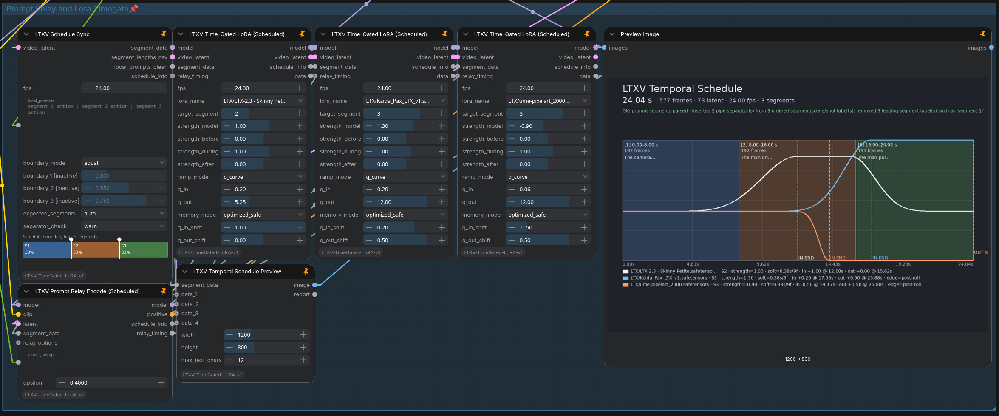

# ComfyUI-LTXV-TimeGated-LoRA

**Place LoRA effects exactly where they belong in an LTX 2.3 video.**

Shape one or more visual LoRAs over the video timeline, align them with prompt segments, and inspect the complete schedule before sampling.



## What it does

ComfyUI-LTXV-TimeGated-LoRA provides two ways to control LoRAs over time:

### Temporal Director

A shared timeline for prompt changes and multiple LoRAs.

- Divide a video into up to **4 semantic segments**
- Route a different prompt into each segment
- Assign one or more LoRAs to selected segments
- Shape how each LoRA enters, holds, and leaves
- Shift LoRA transitions ahead of or behind prompt transitions
- Preview the complete schedule in seconds and frames

### Time-Gated LoRA

The original standalone node remains available for workflows that need direct temporal LoRA control without the shared Director schedule.

---

## Highlights

- **Shared prompt and LoRA timeline**
- **Stackable Scheduled Time-Gated LoRAs**
- **Prompt Relay integration**
- **Automatic prompt separator recovery**
- **Independent incoming and outgoing q-curves**
- **Movable curve anchors and centered LoRA peaks**
- **Symmetric first- and last-segment behavior**
- **Seconds-first visual schedule preview**
- **Native sigma tail and trim utility**
- **Runtime patching without rewriting LoRA files**

## Automatic prompt parsing

Prompts may use explicit pipe separators:

```text
The camera holds still | The subject begins to move | The action reaches its peak
```

The Schedule Sync node can also recover missing separators from ordered labels:

```text
segment 1: The camera holds still.

segment 2: The subject begins to move.

segment 3: The action reaches its peak.
```

This is normalized automatically to three clean prompt segments.

Blank-line-separated paragraphs can also be used when no pipes or segment labels are present.

---

## Main nodes

| Node | Purpose |
|---|---|
| **LTXV Schedule Sync** | Creates the shared segment schedule |
| **LTXV Prompt Relay Encode (Scheduled)** | Encodes segment prompts and provides shared transition timing |
| **LTXV Time-Gated LoRA (Scheduled)** | Applies a LoRA to a selected schedule segment |
| **LTXV Temporal Schedule Preview** | Displays segments, durations, prompts, and LoRA curves |
| **LTXV Time-Gated LoRA (LTX 2.3)** | Standalone classic TimeGate workflow |
| **LTXV Sigma Tail / Trim** | Selects or trims a native ComfyUI sigma schedule |

Additional envelope preview, inspection, and segment-planning helpers are included.

---

## Temporal Director setup

Connect the same `segment_data` output from **LTXV Schedule Sync** to:

- **LTXV Prompt Relay Encode (Scheduled)**
- every **LTXV Time-Gated LoRA (Scheduled)**
- **LTXV Temporal Schedule Preview**

Connect `relay_timing` from the Scheduled Prompt Relay node to every Scheduled TimeGate.

Each Scheduled TimeGate can then target a different segment while remaining synchronized to the same prompt timeline.

```text
LTXV Schedule Sync
 ├─ segment_data ──> Prompt Relay Encode (Scheduled)
 ├─ segment_data ──> Time-Gated LoRA (Scheduled) #1
 ├─ segment_data ──> Time-Gated LoRA (Scheduled) #2
 └─ segment_data ──> Temporal Schedule Preview

Prompt Relay Encode (Scheduled)
 └─ relay_timing ──> all Scheduled TimeGate nodes
```

The `data` output of each Scheduled TimeGate can be connected to `data_1` through `data_4` on the preview node.

---

## LoRA curve controls

Each Scheduled TimeGate provides three strength levels:

- `strength_before`
- `strength_during`
- `strength_after`

With `ramp_mode = q_curve`, the transition shape is controlled by:

- `q_in`
- `q_out`
- `q_in_shift`
- `q_out_shift`

The shift controls can move transitions between neighboring segment midpoints.

This supports:

- gradual lead-ins before a prompt change
- delayed LoRA activation
- effects that continue into the following segment
- early fade-outs
- centered LoRA peaks without a plateau

The first and last segments use symmetric virtual pre-roll and post-roll regions, so their curves behave like internal segment boundaries.

---

## Installation

### ComfyUI Manager

Search for:

```text
ComfyUI-LTXV-TimeGated-LoRA
```

Install the node package and restart ComfyUI.

### Git

```bash
cd ComfyUI/custom_nodes
git clone https://github.com/Jinx138/ComfyUI-LTXV-TimeGated-LoRA.git
```

Restart ComfyUI and hard-refresh the browser.

To update later:

```bash
cd ComfyUI/custom_nodes/ComfyUI-LTXV-TimeGated-LoRA
git pull
```

## Requirements

- ComfyUI
- Python 3.10 or newer
- An LTX 2.3 video workflow
- Visual LTX 2.3 LoRA files

No additional Python packages are required by this repository.

---

## Scope

- Temporal control currently targets **visual LTX 2.3 LoRA layers**
- Temporal audio LoRA gating is not included
- The Temporal Director supports up to **4 prompt segments**
- Existing classic Time-Gated LoRA workflows remain supported

Because LoRAs can affect motion, anatomy, detail, and temporal consistency differently, test unfamiliar LoRAs individually before stacking them.

---

## Prompt Relay credits

Prompt scheduling support references:

- [Prompt Relay](https://gordonchen19.github.io/Prompt-Relay/) by Gordon Chen, Ziqi Huang, and Ziwei Liu
- [ComfyUI-PromptRelay](https://github.com/kijai/ComfyUI-PromptRelay) by Kijai

See [NOTICE.md](NOTICE.md) for attribution details.

---

## Documentation

- [Release notes for v1.3](RELEASE_NOTES_v1.3.md)
- [Changelog](CHANGELOG.md)
- [License](LICENSE)
